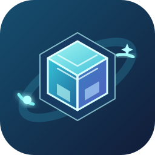

<p align="center"></p>

<h1 align="center">CraftShelf</h1>

<p align="center">
Minecraft のプラグイン・Mod・データパック・リソースパック・シェーダー・Modパックを<br>
ドラッグ&ドロップで整理・保管し、更新の確認からサーバーへの反映までまとめて行うセルフホストの Web パネル
</p>

<p align="center"><a href="README.en.md">English</a> · <a href="CHANGELOG.md">変更履歴</a></p>

---

## 特長

- 📦 **放り込むだけで整理**: jar / zip やフォルダをドロップするだけで、名前・バージョン・対応 MC・サーバーソフトを自動で読み取って保存
- 🔗 **配布サイトと連携**: Modrinth / SpigotMC / CurseForge と自動で紐付け、更新を定期的にチェックして新しい版をワンクリックで保存
- 🧩 **前提プラグインのチェック**: 足りない前提プラグイン・Mod を見つけて、検索から追加
- 🖥️ **Pterodactyl 連携**: サーバーへのワンクリック同期・サーバー同士の比較・同期前の状態への巻き戻し・予約同期
- 🗂️ **保存先を選べる**: ローカルフォルダ / SMB(Unraid・TrueNAS・Synology・Windows 共有)/ WebDAV(Nextcloud など)
- 👥 **複数人で使える**: 閲覧のみ・編集者・管理者の権限、二段階認証、API トークン、操作の記録
- 🌐 **日本語 / English** の切り替え、テーマと背景のカスタマイズ、スマホ対応

## できること

- **ドロップで登録**: ファイル・フォルダ(まとめて数百個でも可)をブラウザに投げ込む。フォルダは中の .jar / .zip だけを拾います
- **自動で名前とバージョンを読み取り**
  - プラグイン: `plugin.yml` / `paper-plugin.yml` / `bungee.yml` / `velocity-plugin.json`
  - Mod: `fabric.mod.json` / `quilt.mod.json` / `mods.toml` / `neoforge.mods.toml` / `mcmod.info`
  - データパック・リソースパック: `pack.mcmeta`(名前・バージョンは無いのでファイル名から推測、`pack_format` も表示)
  - シェーダー・Modパック: `shaders/` フォルダ、`modrinth.index.json` / `manifest.json`
  - 読めなかったら「その他」に入れます(あとから編集できます)
- **配布元(Modrinth / SpigotMC / CurseForge)と連携して、最新版の確認・ダウンロード**(下記)
- **アカウントでログイン**(閲覧のみ / 編集者 / 管理者)
- **名前をクリック → 保存済みの全バージョンを一覧**(新しい順/古い順、1.10 が 1.9 より新しい、beta より正式版が新しい、といった自然な順序で並びます)
- 同じファイルを二重に登録しない(中身のSHA-256で判定)
- 名前・バージョン・メモの編集、ダウンロード、削除
- 名前・保存数・サイズ・最終追加日での並び替え、種類・サーバーソフト・MCバージョンでの絞り込み、検索
- **一括操作**: 一覧の「選択」でチェックしたものをまとめてダウンロード・共有リンク作成・サーバーへ転送・タグ付け・削除
- **共有リンク**: ログインしていない人でもダウンロードできる期限付きリンク
- **英語表示**: 設定の「言語 / Language」で切り替え
- **アイコン**: 配布元と連携したものは、配布元のアイコンを取得して表示
- **保存先の状況**: 右上の保存先の表示を押すと、NAS などの接続状態・応答時間・容量・空き容量を確認
- **inbox取り込み**: 保存先の `inbox/` フォルダに直接コピーしたファイルを一括登録(既存コレクションの初回取り込みに便利)

## ファイルの保存形式

保存先には人が見てもわかる形で保存されます。このツールが壊れても、ファイルはそのまま使えます。

```
<保存先>/
  library/
    plugins/WorldEdit/WorldEdit-bukkit-7.3.0.jar
    plugins/WorldEdit/WorldEdit-bukkit-7.2.15.jar
    mods/Fabric API/fabric-api-0.92.0+1.20.1.jar
    datapacks/Terralith/Terralith_v2.5.5.zip
    resourcepacks/...
  inbox/        ← ここに入れて「inboxを取り込む」
  index.db      ← 名前・バージョンなどの記録(SQLite)
```

`index.db` を失っても、`library/` に置かれたファイルは「inboxを取り込む」で再登録できます(メモは消えます)。

## インストール

| 使い方 | おすすめの方法 |
| --- | --- |
| 自分の PC(Windows / Mac)で使う | [インストーラー版](#インストーラー版windows--macos--linux) |
| Ubuntu / Debian のサーバーで常駐させる | [インストールスクリプト](#ubuntu--debian-のサーバー) |
| NAS・Docker 環境で動かす | [Docker](#導入docker) |

### インストーラー版(Windows / macOS / Linux)

[Releases](https://github.com/mesamaru/craftshelf/releases/latest) から、お使いの OS のファイルをダウンロードします。

- **Windows 10 / 11**: `CraftShelf-Setup-<版>.exe` を実行してインストール。管理者権限は不要です。起動するとタスクトレイにアイコンが出て、ブラウザで画面が開きます
- **macOS**: `CraftShelf-<版>-macos-arm64.dmg`(Apple シリコン)または `-x64.dmg`(Intel)を開き、CraftShelf を「アプリケーション」へドラッグ。メニューバーのアイコンから開けます
- **Linux(デスクトップ)**: `CraftShelf-<版>-linux-x64.tar.gz` を展開して `CraftShelf` を実行

> コード署名をしていないため、初回は「発行元を確認できません」という警告が出ることがあります。Windows は「詳細情報 → 実行」、macOS は CraftShelf を右クリック →「開く」で起動できます。

データの保存先(変更する場合は保存先フォルダに `launcher.json` を置くか、起動オプション `--data-dir` を使います):

| OS | 保存先 |
| --- | --- |
| Windows | `%LOCALAPPDATA%\CraftShelf` |
| macOS | `~/Library/Application Support/CraftShelf` |
| Linux | `~/.local/share/craftshelf` |

初期状態ではこの PC からだけ開けます(`http://127.0.0.1:8765`)。LAN のほかの端末からも使う場合は、保存先フォルダに次の `launcher.json` を置いて再起動してください。

```json
{ "host": "0.0.0.0", "port": 8765 }
```

アップデートは、パネルの ⚙ →「パネルのアップデート」に新しい版が表示されたら、新しいインストーラーをダウンロードして上書きインストールします(データはそのまま残ります)。

### Ubuntu / Debian のサーバー

次の 1 行で、ダウンロードから常駐サービス(systemd)の登録まで行います。もう一度実行すると最新版に更新されます。

```bash
curl -fsSL https://raw.githubusercontent.com/mesamaru/craftshelf/main/install.sh | sudo bash
```

- ブラウザで `http://<サーバーのIP>:8765` を開きます(ポートは `CRAFTSHELF_PORT=9000` のように指定して変更できます)
- データは `/var/lib/craftshelf`、プログラムは `/opt/craftshelf` に置かれます
- パネルの「パネルのアップデート」からそのまま更新できます
- 状態の確認: `systemctl status craftshelf` / ログ: `journalctl -u craftshelf -f`
- 削除: `curl -fsSL https://raw.githubusercontent.com/mesamaru/craftshelf/main/install.sh | sudo bash -s -- --uninstall`(データは残ります)

## 導入(Docker)

Docker と Docker Compose が使える環境(Linux サーバー、NAS、Dockge / Portainer など)で動きます。

1. このリポジトリを取得する

   ```bash
   git clone https://github.com/mesamaru/craftshelf.git
   cd craftshelf
   ```

2. 必要なら `docker-compose.yml` を編集する
   - `volumes` の左側: ファイルを保存する場所(既定は `./data`。NAS なら例: `/mnt/user/minecraft/library`)
   - `ports` の左側: ブラウザで開くポート(既定 `8765`)
   - `TZ`: タイムゾーン(予約同期や表示の時刻に使います)

3. 起動する(Dockge / Portainer なら画面から「デプロイ」)

   ```bash
   docker compose up -d --build
   ```

4. ブラウザで `http://<サーバーのIPアドレス>:8765` を開き、初期設定画面で管理者アカウントを作成する

> **Unraid で使う場合**: `volumes` を `/mnt/user/<共有名>/...:/data` のように共有フォルダに向けます。コンテナを `nobody:users`(99:100)で動かしたい場合は `docker-compose.yml` のコメントを参照してください。

## アップデート

CraftShelf は GitHub(https://github.com/mesamaru/craftshelf)の `main` ブランチから最新版を取得します。

- **画面から**: 右上の ⚙(設定)→「パネルのアップデート」(管理者のみ)で、GitHub の最新版と変更内容を確認できます。新しい版があれば「ダウンロードしてインストール」を押すだけで、ダウンロード・インストール・再起動まで自動で行い、進み具合が画面に表示されます
- **自動で**: 同じ画面の「自動アップデート」をオンにすると、6時間ごとに確認して自動で更新します(既定はオフ)
- **起動時**: コンテナを起動するたびにも最新版を取得します(`AUTO_UPDATE=false` で停止。取得元は `GITHUB_REPO` で変更できるので、フォークしたリポジトリを使うこともできます)

保存したファイル・登録情報(`/data`)はアップデートしても消えません。

### バージョン

バージョンは `00.00.00`(メジャー.マイナー.修正)の形式で、画面右上に表示されます。変更のたびに更新し、内容は [CHANGELOG.md](CHANGELOG.md) に記録します。

- メジャー: 互換性のない大きな変更 / マイナー: 機能の追加 / 修正: 不具合の修正・細かな改善

## ログイン(アカウント)

初めて画面を開くと「初期設定」画面になるので、**管理者アカウント**を作成してください。以降はログインが必要です。

右上の ⚙(設定)→「ユーザー」(管理者のみ)から、ほかのユーザーを追加できます。

| 権限 | できること |
| --- | --- |
| 閲覧のみ | 一覧の閲覧・ダウンロード |
| 編集者 | ＋ 登録・編集・削除・inbox取り込み・配布元の紐付け・更新の確認と保存 |
| 管理者 | ＋ ストレージ設定・保存先の移行・ユーザー管理・設定 |

- パスワードはハッシュ化して保存されます。ログインの失敗が続くと10分ほどロックされます
- パスワードを忘れた場合は、ほかの管理者が「ユーザー管理」から再設定できます
- 環境変数 `AUTH_USER` / `AUTH_PASS` を指定しておくと、ユーザーが1人もいないときにその名前で管理者が自動作成されます(以前のBasic認証の設定は、そのまま管理者アカウントとして引き継がれます)

## 画面の構成

下のタブバーで切り替えます。

- **ライブラリ**: 登録したプラグイン・Mod の一覧。種類・更新あり・前提が不足・対応MCバージョンで絞り込めます
- **ダッシュボード**: 全体の状況(下記)
- **セット**: よく使う組み合わせ(サーバー構成セット)
- **サーバー**: Pterodactyl と連携したサーバー

## Pterodactyl 連携

1. Pterodactyl パネルの「アカウント → API 認証情報」で **Client API キー(ptlc_…)** を作る
2. CraftShelf の ⚙(設定)→「Pterodactyl 連携」にパネルの URL とキーを入れて保存
3. 「サーバー」タブ →「サーバーを連携」で、使うサーバーとプラグインのフォルダ(既定 `/plugins`、Mod サーバーなら `/mods`)を選ぶ

できること:

- **中身を確認**: サーバーのフォルダのファイルをライブラリと照らし合わせ、「最新 / 更新あり / 未登録」を表示。未登録のものはライブラリに取り込めます
- **同期**: ライブラリに新しいバージョンがあるものを置き換えます。セットを結び付けておくと、セットにあってサーバーに無いものも入れます。完了後の再起動も選べます
- **転送**: 選んだアイテムやセットをサーバーへ送ります(同じプラグインの別のバージョンがあれば置き換え)

ファイルの送受信は、パネルが発行する署名付き URL を使ってノード(Wings)と直接行うため、CraftShelf のコンテナからノードのアドレスに接続できる必要があります。

### サーバーの比較・巻き戻し・予約同期

- **比較**: 「サーバー」タブの「比較」で、複数のサーバーを横に並べてプラグインの有無・バージョン・更新の有無を見比べられます。「違いだけ表示」で差がある行だけにできます
- **履歴と巻き戻し**: 同期・転送の前に置き換えるファイルを自動で退避しています(サーバーごとに直近 10 回分)。サーバーの「…」→「履歴と巻き戻し」から、その同期の前の状態に戻せます
- **予約同期**: サーバーの「…」→「設定・予約同期」で、毎日・毎週の決まった時刻に自動で同期できます(コンテナの TZ の時刻)

## サーバー構成セット

「セット」タブで、よく使う組み合わせを保存できます。アイテムごとに「常に最新」か「特定のバージョンに固定」を選べます。zip でまとめてダウンロードしたり、サーバーへまとめて転送したりできます。前提プラグインが足りない場合は警告します。

## 配布サイトから探す・Modパックの読み込み・タグ

- **探す**: 右上の ＋ →「配布サイトから探して追加」で、Modrinth / SpigotMC / CurseForge を種類・ローダー・MCバージョンで絞り込んで検索し、そのまま追加できます
- **Modパック**: ＋ →「Modパックを読み込む」で、Modrinth(.mrpack)や CurseForge のModパック(zip。APIキーが必要)の中の Mod をまとめて登録し、セットも作れます
- **タグ**: 詳細の「情報を編集」で自由にタグを付けられます。一覧の上のタグを押すと絞り込めます

## 前提プラグインのチェック

plugin.yml(depend / softdepend)、paper-plugin.yml、Fabric・Quilt・Forge・NeoForge の依存情報を読み取り、ライブラリに無い前提プラグイン・Mod を警告します。詳細画面で「必須 / 任意」とライブラリにあるかどうかを確認できます。

## セキュリティ・API

- **二段階認証**: ⚙ → アカウント →「二段階認証」。認証アプリ(Google Authenticator など)で QR コードを読み取って設定します。回復コードは必ず保管してください。管理者は「ユーザー」から他のユーザーの二段階認証をリセットできます
- **APIトークン**: ⚙ → アカウント →「APIトークン」。`Authorization: Bearer cs_…` ヘッダーで API を呼べます。トークンの権限は作成者の権限以下で選べます。例: `curl -H "Authorization: Bearer cs_xxx" http://<サーバー>:8765/api/library`

## 通知・バックアップ・記録

- **Discord 通知**: ⚙(設定)→「Discord 通知」で Webhook の URL を登録。通知する出来事を選べます
- **自動バックアップ**: ⚙(設定)→「バックアップ」で保存先を選ぶと、毎日1回、登録情報(index.db)・暗号鍵・背景画像を zip にして `_craftshelf_backup` フォルダに保存します
- **古いバージョンの自動整理**: 詳細の「情報を編集」で、アイテムごとに残す数を設定できます
- **操作の記録**: ⚙(設定)→「操作の記録」で、誰がいつ何をしたかを確認できます

## ダッシュボード

見出しの横の「ダッシュボード」で、登録数・使用容量・更新があるもの・種類ごとの件数・配布元の連携状況・最近追加したもの・保存先の状態・確認が必要なもの(ファイルの欠損など)・サーバーの同期状況をまとめて確認できます。

右上の「ウィジェットを編集」で、ドラッグ(スマホでは矢印ボタン)による並べ替え、表示・非表示、全幅・半分の幅を切り替えられます。配置はアカウントごとに保存され、「初期状態に戻す」でいつでも元に戻せます。

## 対応MCバージョン

絞り込みや検索で選べる MC バージョンは、Mojang の公式一覧から 12 時間ごとに自動で取得します(新しいバージョンが出ると自動で追加されます)。

ファイルの中身(plugin.yml の api-version、fabric.mod.json、mods.toml)や配布元の情報から自動で判定して表示します。違っている場合は、詳細の「情報を編集」で書き換えられます(空欄に戻すと自動判定に戻ります)。

## テーマと背景

右上の ⚙(設定)→「テーマと背景」で、パネルの背景を変えられます(アカウントごとに保存)。

- 用意されたテーマ: ミント / オーロラ / サンセット / オーシャン / オーバーワールド / ネザー / ジ・エンド / パステル / グラファイト
- 好きな画像(PNG / JPEG / WebP / GIF、15MBまで)をアップロードして背景にすることもできます
- 「暗さ」「ぼかし」で、文字が読みやすくなるよう調整できます

## 配布元との連携・更新の取得(Modrinth / SpigotMC / CurseForge)

登録したプラグイン・Modを配布サイトと紐付けると、最新版の確認と、更新ファイルのダウンロード・保管ができます。

- **自動で探す**: 保存済みファイルのハッシュで Modrinth(CurseForge はAPIキー登録時)を照合し、一致すれば自動で紐付けます。プラグインは SpigotMC で名前が完全に一致するものがあれば紐付けます(名前での推定なので、違っていたら「紐付け直す」)。見つからない場合は候補が表示されます
- **URLで紐付け**: 配布ページのURL(例 `https://modrinth.com/plugin/luckperms`、`https://www.spigotmc.org/resources/luckperms.28140/`、`https://www.curseforge.com/minecraft/mc-mods/jei`)を貼り付け
- **URLから追加**: まだ持っていないものを、配布ページのURLから最新版をダウンロードして登録します
- **更新を確認**: 紐付け済みのものをまとめて確認し、新しい版があれば一覧に「更新あり」と表示します。「その他… → 確認して更新をすべて保存」で一括ダウンロードもできます
- **絞り込み**: Mod は「ローダー(fabric / neoforge / forge など)」と「Minecraftのバージョン」で絞り込まないと、別のMCバージョン向けの版が最新と判定されることがあります。アイテムの「絞り込みを変更」で設定してください(ハッシュで見つかった場合は自動で設定されます)
- **定期確認**: ⚙(設定)→「配布元の更新確認」で、6時間〜1週間ごとの自動確認と、見つかった更新の自動ダウンロードを設定できます

注意:
- **NeoForge / Forge / Fabric** は Mod の「ローダー」の種類で、Mod 自体は Modrinth / CurseForge で配布されています。ローダーの絞り込みで対応します
- **CurseForge** は公式APIキーが必要です(https://console.curseforge.com で無料発行 → ⚙(設定)→「CurseForge APIキー」に登録)。また作者が外部ツールからのダウンロードを許可していないファイルは、自動ダウンロードできません(配布ページへのリンクが表示されます)
- **SpigotMC** は非公式API(Spiget)を使います。有料リソースや外部サイトで配布されているものは自動ダウンロードできません
- コンテナからインターネット(api.modrinth.com / api.spiget.org / api.curseforge.com)に接続できる必要があります

## 保存先の中身の確認と移行

⚙(設定)→「ストレージ」で各保存先を開くと:

- **中身を確認**: 登録済みの件数・サイズ・見つからないファイル・未登録のファイル・inbox の中身を、切り替えずに確認できます
- **移行…**: 登録済みのファイルと情報(バージョン・メモ・配布元の紐付け)を、別の保存先へ **コピー** または **移動** します。移行先に同じファイルがあればスキップするので、何度実行しても重複しません。処理は裏で進み、画面上部に進み具合が表示されます

## 保存先をWeb画面から追加登録する(SMB / WebDAV・Nextcloud)

`docker-compose.yml` の `volumes` で指定した場所(初期状態では「ローカル」という保存先として扱われます)以外に、画面右上の ⚙(設定)→「ストレージ」から、SMB(Windows共有)や WebDAV(Nextcloud など)の接続情報を登録して、いつでも切り替えて使えます。NAS を使い続けつつ、あとから別の NAS や Nextcloud を追加で登録する、といった使い方ができます。

### 使い方

1. 画面右上の ⚙(設定)→「ストレージ」を開き、「接続を追加」
2. 名前・種類を選んで入力
   - **SMB**(Unraid・TrueNAS・Synology・Windows 共有など): サーバー(IPアドレス)・共有名。ゲスト接続を許可した共有ならユーザー名は空欄でOK
   - **WebDAV**(Nextcloud など): URL・ユーザー名・パスワード。Nextcloud ならサーバーのURL(例 `https://cloud.example.com`)だけで、`/remote.php/dav/files/<ユーザー名>` は自動で補います。二段階認証を使っている場合は Nextcloud の「設定 → セキュリティ」で作った**アプリパスワード**を使ってください。自己署名証明書なら「証明書を検証しない」をオン
   - サブフォルダ(任意)を指定すると、共有の中のそのフォルダを保存先にします(無ければ作ります)
3. 「接続をテスト」で読み書きできるか確認してから「保存」
4. 一覧に追加された接続の「使用する」を押すと切り替わります

**切り替えると表示される一覧もその保存先のものに変わります**(それぞれの保存先は完全に独立したコレクションとして管理され、混ざりません)。ファイルの自動移行(コピー)は行わないので、既存のコレクションを別の保存先でも使いたい場合は、ファイルをその保存先の `inbox/`(または `library/`)にコピーしてから「inboxを取り込む」を使ってください。

### 特別な権限は不要

SMB / WebDAV はアプリ(Python)が直接通信する方式なので、OSの `mount` は使いません。`cap_add` / `security_opt` / `privileged` などの設定は不要で、Proxmox の非特権LXC の中の Docker でもそのまま動きます。

### そのほかの注意点

- 登録したパスワードはコンテナ内(`/config/secret.key` または `DATA_DIR` 配下)の鍵で暗号化して保存されます。バックアップの際はこの鍵ファイルも一緒に扱われるようにしてください(鍵を失うと保存済みパスワードは復号できなくなります)。
- `index.db`(登録情報)は常にコンテナ側(`CONFIG_DIR`)に置かれ、SMB / WebDAV 側にはファイル本体だけが保存されます。
- コンテナ起動時に、そのとき「使用中」になっている保存先へ自動で接続を試みます。NASの電源が入っていないなど接続に失敗した場合は、画面上部に警告バナーが表示され、アップロードはできませんが、アプリ自体は起動します。30秒ごとに自動で繋ぎ直しを試みるほか、設定パネルの「再接続」でもすぐ試せます。
- 「ローカル」保存先(初期状態、`docker-compose.yml` の `volumes` で指定した場所)は削除できません。

## PC上で試す(Dockerなし)

```
pip install -r requirements.txt
python app.py
```

`http://127.0.0.1:8765` が開けます。保存先を NAS にしたい場合は、NAS の共有フォルダをドライブにつないだうえで環境変数で指定します。

```
# Windows
set DATA_DIR=Z:\mc-library
python app.py
# 他のPCからもアクセスしたい場合は  set HOST=0.0.0.0  も追加
```

## 設定(環境変数)

| 変数 | 既定値 | 内容 |
| --- | --- | --- |
| `DATA_DIR` | `./data`(Dockerでは `/data`) | 「ローカル」保存先の場所 |
| `CONFIG_DIR` (`DB_DIR`でも可) | `DATA_DIR` と同じ | `index.db` や暗号化鍵、ストレージ設定だけ別の場所(appdataなど)に置く場合 |
| `PORT` / `HOST` | `8765` / `127.0.0.1` | `python app.py` で起動するときのみ |
| `AUTH_USER` / `AUTH_PASS` | なし | ユーザーが1人もいないときに、この名前・パスワードで管理者を自動作成する |
| `GITHUB_REPO` | `mesamaru/craftshelf` | アップデートの取得元(`ユーザー名/リポジトリ名`) |
| `GITHUB_BRANCH` | `main` | 取得するブランチ |
| `AUTO_UPDATE` | `true` | `false` にすると自動更新を止める |

## 注意

- ログインは必須ですが、LAN 内での利用を想定した道具です。インターネットに公開する場合は、HTTPS のリバースプロキシの後ろに置き、二段階認証を有効にしてください(VPN や Tailscale 経由での利用がより安全です)。
- 脆弱性を見つけた場合は [SECURITY.md](SECURITY.md) の方法で報告してください。
- `index.db` は SQLite です。ネットワーク共有の上でロックのエラーが出る場合は、`DB_DIR`(`CONFIG_DIR`)をローカルディスクに分けてください。
- 「削除」は保存先のファイルも実際に消します(ゴミ箱はありません)。

## ライセンス

[LICENSE](LICENSE) を参照してください。

Minecraft は Mojang Studios の商標です。CraftShelf は Mojang Studios・Microsoft・各配布サイトとは関係のない非公式のツールです。
